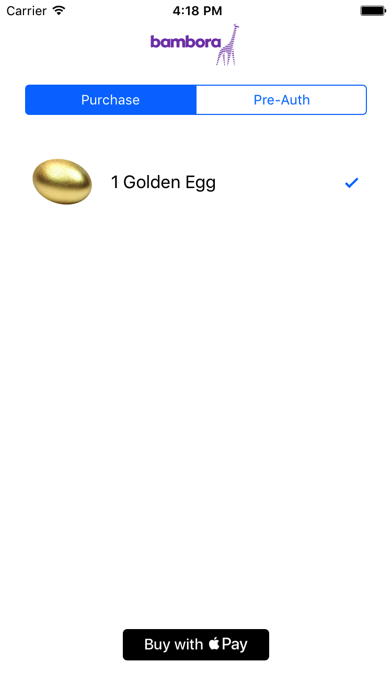

# Mobile Payments Demo Merchant Client & Server

Copyright © 2017 Bambora Inc.


This repo contains an iOS client to demonstrate Apple Pay along with a simple merchant Python/Flask 
server to help process the payment.
 


The Apple Pay payment request flows from the iOS client and then, if successful, an Apple Pay token is 
transmitted to the demo merchant server, which records the payment request and executes the Bambora 
Merchant API.

In your production flow, the mobile client might transmit other info such as the customer identifier, 
detailed sales/inventory data, and related shipping and billing addresses. This info might be recorded 
on a merchants CRM (as an example), and then a request to process the payment using the Apple Pay token 
would then be made to the Bambora Merchant API. Upon success or failure to process the payment, the 
merchant’s CRM could be updated and the originating mobile client would then receive a response.
 
This repo's demo client and server are intended to be simple examples to help you with your production 
implementation.

:-)

# Client

The iOS client project was built with XCode 8 and requires Swift 3.0.

For details on how to develop Apple Pay enabled apps please visit:
- https://developer.apple.com/library/content/ApplePay_Guide/index.html#//apple_ref/doc/uid/TP40014764-CH1-SW1

# Server

The server project requires Python 3. To build & run the server for local dev you can use a SQLite DB and 
try the server out by just setting your Bambora Merchant API Passcode as a server side environment variable 
and then start up as follows.

When the client makes a payment request, it first gets an Apple Pay payment token using standard Apple SDK 
APIs. It then communicates this info to the Demo Server which is responsible for interacting with the 
Bambora Merchant API. The Bambora Merchant API has been updated to allow for Apple Pay transactions 
and the following is a sample POST parameter to use with a RESTful invocation of the Payments API.

```
payload = {
    'amount': float(<purchase_amount>),
    'payment_method': 'apple_pay',
    'apple_pay': {
        'apple_pay_merchant_id': <your_apple_pay_merchant_id>,
        'payment_token': <apple_pay_base64_encoded_token>,
        'complete': <true (Defaults to true if omitted. Used for a purchase) | false (Used for a Pre-Auth.)>
    }
}
```

## Server Setup & Installation

* Execute a git clone command on this repo and in a terminal cd into the root project directory.
```bash
$ git clone https://github.com/Bambora/na-mobilepayments-demo.git
$ cd mobilepayments-demo/server/app
```

* Install virtualenv (if not already available)
```bash
$ [sudo] pip install virtualenv
```

* Create (if not already create) and/or Activate project environment
```bash
$ virtualenv -p python3 venv
$ source venv/bin/activate
```

* Install/update project dependencies
```bash
(venv) app$ pip install -r requirements.txt
```

## Execution

* To run the flask app just for development only (not for production) just do this:
```bash
(venv) app$ export DATABASE_URL=sqlite:////tmp/mobilepay-demo.db  # Defaults to this and can be ommitted
(venv) app$ export BIC_API_PASSCODE=<your_merchant_passcode>
(venv) app$ export BIC_MERCHANT_ID=<your_bambora_merchant_id>
(venv) app$ python server.py
```

Or if on Windows follow the same as above except set your environment variables via PowerShell as follows.
```
(venv) app$ $env:BIC_API_PASSCODE = "<your_merchant_passcode>"
(venv) app$ $env:BIC_MERCHANT_ID = "<your_bambora_merchant_id>"
(venv) app$ $env:DATABASE_URL = "sqlite:////users/<your_user>/appdata/local/temp/mobilepay-demo.db"
```

---

<a name="contributing"/>

## Building Locally and Contributing

 * Check out repo: `$ git clone https://github.com/Bambora/na-mobilepayments-demo.git`
 * Fork the repo to commit changes to and issue Pull Requests as needed.

---

# API References
* [Mercant Quickstart](https://developer.na.bambora.com/docs/guides/merchant_quickstart/)
* [Merchant API](https://developer.na.bambora.com/docs/references/merchant_API)
 * [Apple Pay @ Bambora](https://developer.na.bambora.com/docs/guides/apple_pay/)
* [Getting Started with Apple Pay](https://developer.apple.com/apple-pay/get-started/)
* [Apple Pay Programming Guide](https://developer.apple.com/library/content/ApplePay_Guide/)
* [Apple Pay Sandbox Testing](https://developer.apple.com/support/apple-pay-sandbox/)
